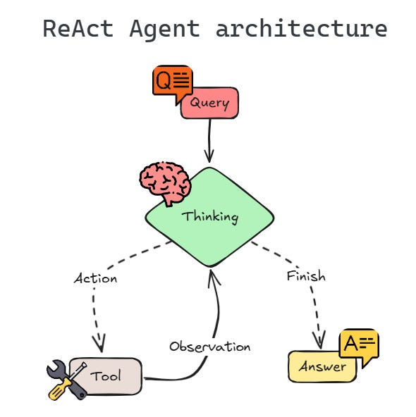

# ReAct Agent

A simple ReAct-style agent that uses Google Gemini for reasoning and local Python tools for actions.

## Overview

This project demonstrates a lightweight ReAct loop:

1. **Reason** using Gemini
2. **Act** using local tools (`get_summary`, `addition`)
3. **Observe** tool output
4. **Repeat until final answer**

The agent interprets tool calls written like:

```
Action: addition[5 and 4]
```

#

## Setup

1. Install dependencies:

   ```bash
   uv sync
   
   ```
2. Create a `.env` file:

   ```
   API_KEY=your_gemini_api_key
   ```

## Run

```bash
uv run main.py
```

## REACT Agent Flowchart

